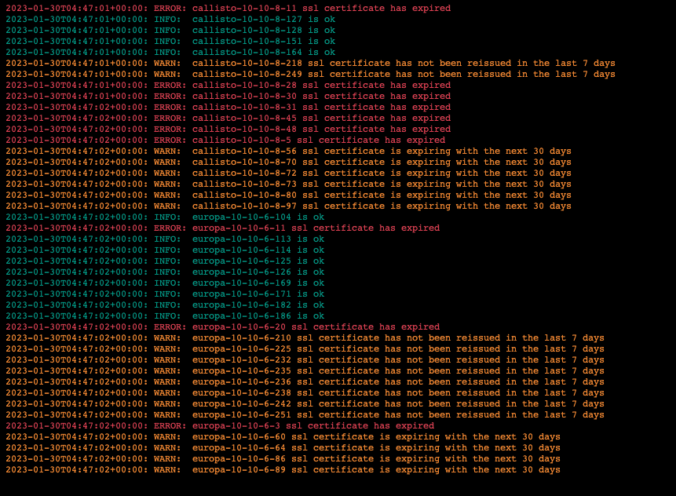

# Cert Check Exercise

This repo provides a working example of checking the expiration of SSL certificates.

## Basic Usage

The entire environment can be created and torn down via terrraform.

```bash
cd terraform
terraform init
terraform apply
```

This will create a mock environment using docker containers with 1 bastion host, 1 statsd host and 43 servers running a minimal express.js web server. A unique locally signed tls/ssl certificate is generated for each web server and they are assigned expirations as follows:

- (0-50) web servers with ip addresses ending in a number less than 50 certificates will be set with a validity period of 0 hours, simulating an expired certificate.
- (51-100) web servers with ip addresses ending in a number between 51 and 100 will use that number * 6 as the number of hours the certificate is valid for, simulating a certificate that would expire sometime in the next month.
- (100-200) web servers with ip addresses ending in a number between 100 and 200 will be assigned 24 * 365 hours as the validity period simulating a certificate that has no issues.
- (201-254) web servers with ip addresses ending in a number between 201 and 254 will be assigend 24 * 365 - (201-254) hours simulating a certificte that missed a weekly renewal.

The bastion host is set up to run cron as PID 1 which alternates the execution of the checkcerts go binary (on even minutes) and the checkcerts.sh bash script (on odd minutes). The checkcerts.sh bash script can be found in the ./scripts the go code is in the ./checkcerts/ directory.  Each script functions similarly and produces the same results. Each retrieves the ssl certificate from each of the aforementioned web servers and checks the certtificates' end date against these criteria:

1. Was the script able to retrieve the certificate successfully?
2. Is the certificate expired?
3. Is the certificate going to expire in the next 30 days?
4. Is the certificate going to expire before 365 days from the preceeding Thursday at midnight (assuming new certs are generated every Thursday and are valid for a year, an expiration before this time indicates it was not renewed on schedule).

The script can be observed via the log file of the bastion container.  Additonally the bastion will update the statsd server with the status and send a notification via a slack webhook url.

### Example Bastion Output:



## Tear Down

To remove all containers and asssociated configuration
```
terraform destroy
```